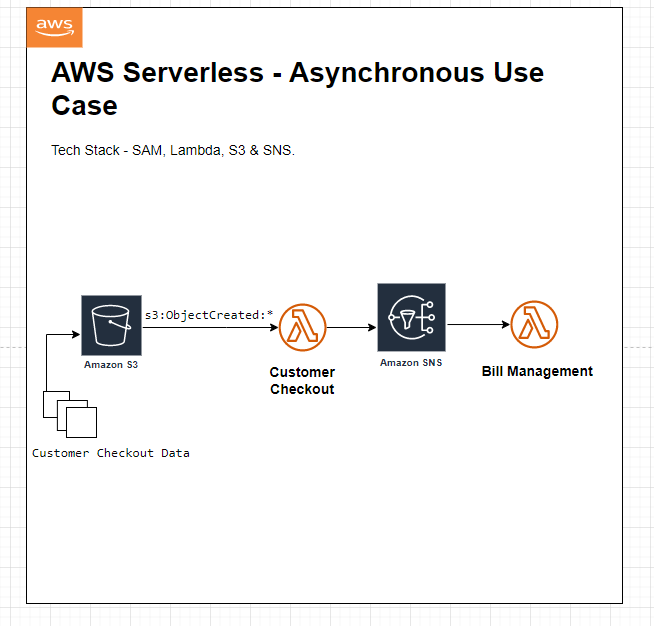

# AWS Serverless

This project contains source code and supporting files for a serverless application that you can deploy with the SAM CLI. It includes the following files and folders.

- ordersapi/src/main - Code for the Orders API Lambda function. Lambda function is exposed using API Gateway.
- customercheckout/src/main - Code for the Orders API Lambda function. Customer Checkout Lambda function is invoked via S3 events and once the vents are processed message is sent to SNS Topic. 
- template.yaml - A template that defines the application's AWS resources.

The application uses several AWS resources, including Lambda functions, API Gateway API, S3 and SNS. These resources are defined in the `template.yaml` file in this project. You can update the template to add AWS resources through the same deployment process that updates your application code.



## Deploy the sample application

To build and deploy your application for the first time, run the following in your shell:

```bash
sam build
sam deploy --guided
```

The first command will build the source of your application. The second command will package and deploy your application to AWS, with a series of prompts:

* **Stack Name**: The name of the stack to deploy to CloudFormation. This should be unique to your account and region, and a good starting point would be something matching your project name.
* **AWS Region**: The AWS region you want to deploy your app to.
* **Confirm changes before deploy**: If set to yes, any change sets will be shown to you before execution for manual review. If set to no, the AWS SAM CLI will automatically deploy application changes.
* **Allow SAM CLI IAM role creation**: Many AWS SAM templates, including this example, create AWS IAM roles required for the AWS Lambda function(s) included to access AWS services. By default, these are scoped down to minimum required permissions. To deploy an AWS CloudFormation stack which creates or modifies IAM roles, the `CAPABILITY_IAM` value for `capabilities` must be provided. If permission isn't provided through this prompt, to deploy this example you must explicitly pass `--capabilities CAPABILITY_IAM` to the `sam deploy` command.
* **Save arguments to samconfig.toml**: If set to yes, your choices will be saved to a configuration file inside the project, so that in the future you can just re-run `sam deploy` without parameters to deploy changes to your application.

You can find your API Gateway Endpoint URL in the output values displayed after deployment.

## Use the SAM CLI to build and test locally

Build your application with the `sam build` command.

```bash
aws-lambda$ sam build
```

The SAM CLI installs dependencies defined in `HelloWorldFunction/pom.xml`, creates a deployment package, and saves it in the `.aws-sam/build` folder.

Test a single function by invoking it directly with a test event. An event is a JSON document that represents the input that the function receives from the event source. Test events are included in the `events` folder in this project.

Run functions locally and invoke them with the `sam local invoke` command.

```bash
aws-lambda$ sam local invoke HelloWorldFunction --event events/event.json
```

The SAM CLI can also emulate your application's API. Use the `sam local start-api` to run the API locally on port 3000.

```bash
aws-lambda$ sam local start-api
aws-lambda$ curl http://localhost:3000/
```

## Fetch, tail, and filter Lambda function logs

To simplify troubleshooting, SAM CLI has a command called `sam logs`. `sam logs` lets you fetch logs generated by your deployed Lambda function from the command line. In addition to printing the logs on the terminal, this command has several nifty features to help you quickly find the bug.

`NOTE`: This command works for all AWS Lambda functions; not just the ones you deploy using SAM.

```bash
aws-lambda$ sam logs -n HelloWorldFunction --stack-name firstlambda --tail
```
## Cleanup

To delete the sample application that you created, use the AWS CLI. Assuming you used your project name for the stack name, you can run the following:

```bash
aws cloudformation delete-stack --stack-name firstlambda
```

## Resources
See the [AWS SAM developer guide](https://docs.aws.amazon.com/serverless-application-model/latest/developerguide/what-is-sam.html) for an introduction to SAM specification, the SAM CLI, and serverless application concepts.

Next, you can use AWS Serverless Application Repository to deploy ready to use Apps that go beyond hello world samples and learn how authors developed their applications: [AWS Serverless Application Repository main page](https://aws.amazon.com/serverless/serverlessrepo/)
